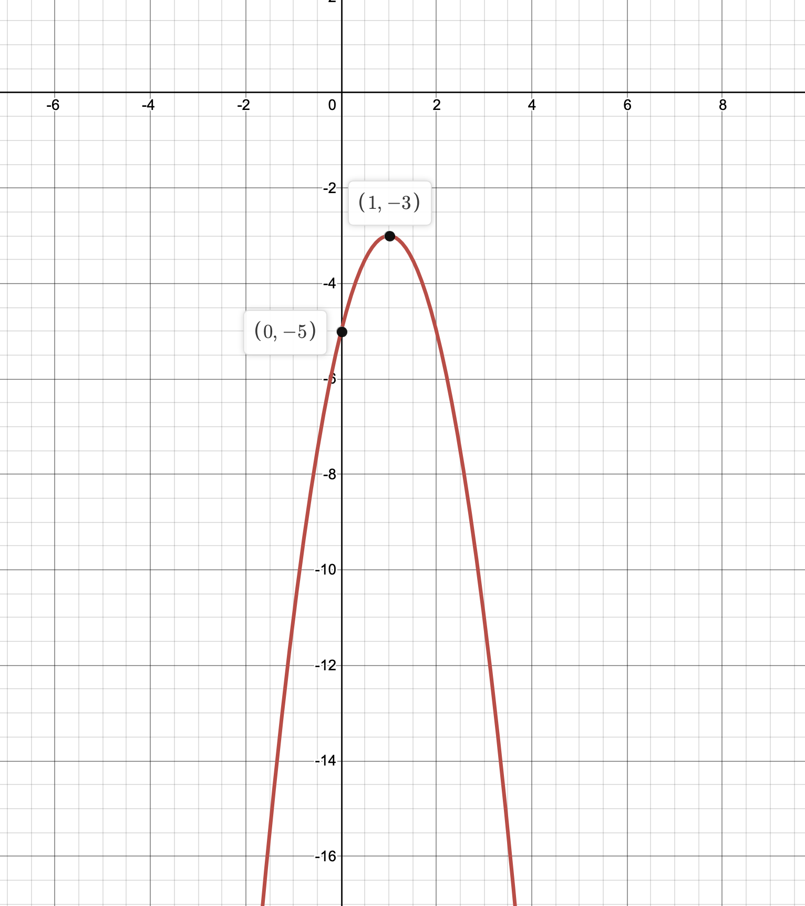

**Math 102 Precalculus- Problem Set 3: Transformations of the Graph of a
Function\
**

------------------------------------------------------------------------

1.  Create a table displaying the "Library of Functions." For each
    function, sketch its graph, list its domain and range in interval
    notation, and identify at least one point on the graph of each
    function that might be easy to track through transformations. Please
    include each of the following functions in your table: $f(x)=a$,
    $f(x)=x$, $f(x)=x^2$, $f(x)=x^3$, $f(x)=\sqrt{x}$,
    $f(x)=\frac{1}{x}$, $f(x)=|x|$. You might want to do this on a
    separate piece of paper and leave room for future functions we will
    study in this class (this might be useful for open-notes exams). The
    format of the table is up to you.

2.  Consider the function $f(x)=x$.

    1.  Shift the graph of $f(x)=x$ two units left (draw this graph).
        What is the equation of this graph? (Recall, shifting the graph
        of $f(x)$ left 2 units corresponds to the equation $f(x+2)$.)

    2.  Shift the graph of $f(x)=x$ two units up (draw this graph). What
        is the equation of this graph? (Recall, shifting the graph of
        $f(x)$ up 2 units corresponds to the equation $f(x)+2$.)

    3.  Compare the graphs you generated. What is similar? Is anything
        different?

    4.  Describe the graph of $f(x)+b$. In the context of
        transformations, what transformation took place (e.g.,
        vertical/horizontal stretching, vertical/horizontal compression,
        vertical/horizontal shifting?)

    5.  How does the transformation relate to the $y$-intercept of
        $f(x)=x+b$?

    6.  Is it possible to view the transformation another way? For
        example, compare the graphs of the "base function" $y=x$ and the
        transformed function $y=x+2$. You worked through two ways you
        can shift the graph of the base function to generate the graph
        of $y=x+2$ in the first two parts of this problem.

    7.  In general, do horizontal shifts and vertical shifts always end
        up generating the same graph? If yes, explain. If no, it is
        sufficient to show one counter-example (for example, compare
        $x^2+2$ and $(x+2)^2$.)

3.  Consider $f(x)= -2(x+1)^2-3.$ We will graph this function by
    sketching the transformations in a series of steps.

    1.  What is the "base function?" (Use your library of functions.)

    2.  Sketch the "base function" and label these three points on it
        which you will track through the transformation:
        $(-1,1)$,$(0,0)$,and $(1,1)$.

    3.  Sketch $(x+1)^2$. Label the new coordinates that correspond with
        the points you are tracking. State in words what you did to
        generate the graph (use language like "I shifted the graph
        left\...").

    4.  Sketch $2(x+1)^2$. Label the new coordinates that correspond
        with the points you are tracking. State in words what you did to
        generate the graph (use language like "I stretched vertically by
        a factor of\...").

    5.  Sketch $-2(x+1)^2$. Label the new coordinates that correspond
        with the points you are tracking. State in words what you did to
        generate the graph (use language like "I reflected the graph
        across the\...").

    6.  Sketch $-2(x+1)^2-3$. Label the new coordinates that correspond
        with the points you are tracking. State in words what you did to
        generate the graph (use language like "I shifted the
        graph\...").

    7.  What was the range of the "base function?" Use interval
        notation.

    8.  What is the range of $f(x)$? Use interval notation.

    9.  How did the range change? Discuss this in the context of the
        transformations you performed. What transformations specifically
        affected the range?

    10. I guided you through the transformations by "building" $f(x)$ in
        steps. Does the order these steps are performed matter? Explain.

4.  Consider $f(x)= -2\sqrt{(x+1)}-3.$ We will graph this function by
    sketching the transformations in a series of steps.

    1.  What is the "base function?" (Use your library of functions.)

    2.  Sketch the "base function" and label these three points on it
        which you will track through the transformation: $(0,0)$,and
        $(1,1)$, $(4,2)$.

    3.  Sketch $\sqrt{(x+1)}$. Label the new coordinates that correspond
        with the points you are tracking. State in words what you did to
        generate the graph (use language like "I shifted the graph
        left\...").

    4.  Sketch $2\sqrt{(x+1)}$. Label the new coordinates that
        correspond with the points you are tracking. State in words what
        you did to generate the graph (use language like "I stretched
        vertically by a factor of\...").

    5.  Sketch $-2\sqrt{(x+1)}$. Label the new coordinates that
        correspond with the points you are tracking. State in words what
        you did to generate the graph (use language like "I reflected
        the graph across the\...").

    6.  Sketch $-2\sqrt{(x+1)}-3$. Label the new coordinates that
        correspond with the points you are tracking. State in words what
        you did to generate the graph (use language like "I shifted the
        graph\...").

    7.  What was the domain of the "base function?" Use interval
        notation.

    8.  What is the domain of $f(x)$? Use interval notation.

    9.  How did the domain change? Discuss this in the context of the
        transformations you performed. What transformations specifically
        affected the domain?

5.  Let $f(x)$ have domain $[-3,5]$ and range $[2, 8]$. Let
    $g(x)=-2f(x+1)-3$.

    1.  What is the domain of $g(x)$? Use interval notation.

    2.  What is the range of $g(x)$? Use interval notation.

6.  Let $f(x)= 3|x-2|+3$.

    1.  Sketch $f(x)$ by tracking three points that you select on the
        graph of the "base function" through each transformation.
        (Please do this like the two previous problems. This time I am
        not breaking down the order of transformations for you.)

    2.  What is the domain of $f(x)$? Use interval notation.

    3.  What is the range of $f(x)$? Use interval notation.

7.  Let $f(x)=x^3$.

    1.  Show that $f(x)$ is odd. (Hint: this is a review question. You
        can revisit section 2.5 for a refresher.)

    2.  Consider $-f(x) = -x^3$. In terms of transformations, what
        happened to the graph of $f(x)$ to generate the graph of
        $-f(x)$? (Answer in a phrase.)

    3.  Sketch the graph of $-f(x)$.

    4.  Consider $f(-x)=(-x)^3$. In terms of transformations, what
        happened to the graph of $f(x)$ to generate the graph of
        $f(-x)$? (Answer in a phrase.)

    5.  Sketch the graph of $f(-x)$.

    6.  Compare the graphs. Is there anything different about them?

8.  Let $f(x)$ be an odd function.

    1.  What does it mean for $f(x)$ to be odd? Give your answer both
        with an equation and a comment about the graph of $f(x)$. (Hint:
        this is a review question. You can revisit section 2.5 for a
        refresher.)

    2.  Consider $-f(x)$. In terms of transformations, what happened to
        the graph of $f(x)$ to generate the graph of $-f(x)$? (Answer in
        a phrase.)

    3.  Consider $f(-x)$. In terms of transformations, what happened to
        the graph of $f(x)$ to generate the graph of $f(-x)$? (Answer in
        a phrase.)

    4.  Will these graph of $-f(x)$ be the same as or different from the
        graph of $f(-x)$? Justify your answer.

9.  Let $f(x)=x^2+1$.

    1.  Sketch $f(x)$.

    2.  Consider $-f(x)$. In terms of transformations, what happened to
        the graph of $f(x)$ to generate the graph of $-f(x)$? (Answer in
        a phrase.)

    3.  Sketch the graph of $-f(x)$.

    4.  Consider $f(-x)$. In terms of transformations, what happened to
        the graph of $f(x)$ to generate the graph of $f(-x)$? (Answer in
        a phrase.)

    5.  Sketch the graph of $f(-x)$.

    6.  Will these graph of $-f(x)$ be the same as or different from the
        graph of $f(-x)$? Justify your answer.

    7.  Will the graph of either $f(-x)$ or the graph of $-f(x)$ be the
        same as the graph of the original function $f(x)$? Explain.

10. Let $f(x)=x^2$.

    1.  Show that $f(x)$ is even. (Hint: this is a review question. You
        can revisit section 2.5 for a refresher.)

    2.  Sketch the graph of $f(x)$.

    3.  What kind of symmetry does this graph have?

    4.  Consider $f(-x)=(-x)^2$. In terms of transformations, what
        happened to the graph of $f(x)$ to generate the graph of
        $f(-x)$? (Answer in a phrase.)

    5.  Sketch the graph of $f(-x)$.

    6.  Compare the graphs of $f(x)$ and $f(-x)$. Are they the same? Can
        you explain why?

11. We learned to complete the square when we studied circles. We found
    this to be useful because it allowed us to write the equation of a
    circle in a form which revealed its center and its radius. For
    example, $(x-1)^2+ (y+2)^2=25$ is a circle with a center at $(1,-2)$
    and a radius equal to $5$. Completing the square can be done for
    quadratics as well. For example, consider $f(x)=2x^2-4x+5$. The
    following mini-steps will help you complete the square (for credit,
    work through the steps):

    1.  Factor the coefficient of $x^2$ out of the first two terms:
        $2(x^2-2x)+5$.

    2.  Find the number you will add and subtract by taking the number
        multiplying the $x$ ($-2$), halving it ($-1$), and then squaring
        it: [$1$]{style="color: blue"}.

    3.  Add and subtract this number inside the parentheses:
        $2(x^2-2x +\textcolor{blue}{1}-\textcolor{blue}{1})+5$

    4.  Group the first three terms in the parentheses and factor:
        $2((x-1)^2-\textcolor{blue}{1})+5$

    5.  Distribute the $2$ to eliminate the first set of parentheses:
        $2(x-1)^2-\textcolor{blue}{2}+5$

    6.  Consolidate the constants: $2(x-1)^2+3$

    7.  Now that $f(x)$ is rewritten in this form, sketch its graph by
        using transformations. Start with the "base function," track
        three points, and show your steps.

    8.  What is the range of $f(x)$? Use interval notation.

12. Consider $f(x)=-2x^2-4x+3$.

    1.  Follow the steps outlined above to complete the square and write
        $f(x)$ in the form $a(x-h)^2+k$.

    2.  Now that $f(x)$ is rewritten in this form, sketch its graph by
        using transformations. Start with the "base function," track
        three points, and show your steps.

    3.  What is the range of $f(x)$? Use interval notation.

13. Below is a graph of a transformed function $g(x)$ with two points
    labeled for you. The base function is $f(x)=x^2$. Write the equation
    of $g(x)$. Hint: it might be helpful to write $g(x)=a(x-h)^2+k$ and
    then use the given points to figure out the constants $a$, $h$, and
    $k$. Recall that if the point $(0,-5)$ is on the graph of $g(x)$,
    then we know that $g(0)=-5$.

    {width="6cm"}

14. Below is a graph of a transformed function $g(x)$ with two points
    labeled for you. The base function is $f(x)=x^2$. Write the equation
    of $g(x)$.

    {width="6cm"}

15. Below is a graph of a transformed function $g(x)$ with several
    points labeled for you. The base function is $f(x)=\sqrt{x}$. Write
    the equation of $g(x)$.

    {width="6cm"}

16. REFLECTION AND CONSOLIDATION

    1.  Summarize the main ideas/formulas you used for this problem set.
        You can list formulas, bullet-out phrases, write a paragraph,
        draw sketches, or answer this question in any way that makes
        sense to you.

    2.  What three problems were the most challenging for you? After
        deciding, look at your solutions carefully, and write a short
        explanation of what you found challenging and how you overcame
        this challenge in your problem solving. For example, did you
        find a simpler problem about the same topic? Did you guess and
        check? Did you graph with technology?

    3.  Write three potential test questions on the topics covered in
        this problem set.
