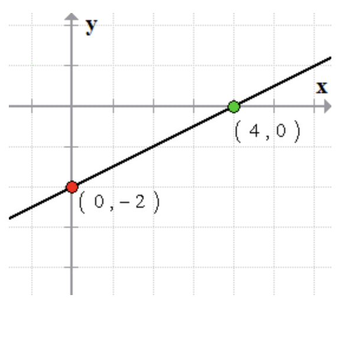
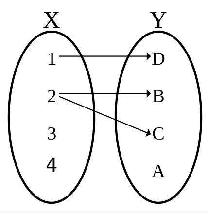

**Math 102 Precalculus- Problem Set 1: Lines, Circles, Distance and
Midpoint Formula, Functions and Domains\
**

------------------------------------------------------------------------

1.  Consider the points $(-1,2)$ and $(0,-2)$.

    1.  Plot and label these points in the $x$-$y$ plane.

    2.  Find the slope of the line connecting these points.

    3.  Write the equation of the line that goes through these points in
        point-slope form.

    4.  Write the equation of the line that goes through these points in
        slope--intercept form.

    5.  Sketch the line and label the $y$-intercept.

2.  Repeat the steps above for the points $(\frac{2}{3},-1)$ an
    $(-\frac{1}{3},-2)$.

3.  Consider the line $y=-2x+5$.

    1.  Determine whether the point $(2,1)$ lies on the graph of the
        line. Approach this problem two ways-- use the equation and also
        use your graph by plotting the point.

    2.  Determine whether the point $(3,-1)$ lies on the graph of the
        line.

    3.  Determine whether the point $(3,-2)$ lies on the graph of the
        line.

4.  Consider the equation $-3x + 6y -2 = 0$.

    1.  Rewrite this equation in slope-intercept form.

    2.  What is the slope of this line?

    3.  What is the $y$-intercept (give as a point)?

    4.  What is the $x$-intercept (give as a point)? Hint: to find an
        $x$-intercept, set $y=0$ and solve for $x$.

    5.  Sketch the line.

    6.  What observations can you make about the general form of the
        equation of a line? For example, what are the powers of $x$ and
        $y$ terms for equations of lines?

5.  Consider the following graph. Write the equation of the line in
    slope-intercept form.

    {width="6cm"}

6.  Consider the line $x=5$.

    1.  List any two points which lie on this line.

    2.  In general, if a point is on this line, what is its
        $x$-coordinate?

    3.  What is the slope of this line?

    4.  We have defined slope to be "rise over run." For the two points
        you selected, what is the rise? What is the run?

    5.  Write a short explanation for why a number divided by zero is
        undefined. Hint: Feel free to use google. Both Wikipedia and
        Khan Academy have explanations.

    6.  Sketch the line.

7.  Consider the line $y=-\frac{1}{3}x-1$.

    1.  Write the equation of the line parallel to the given line and
        passing through the point $(3,2)$. Give your equation in
        slope-intercept form.

    2.  Sketch both lines.

    3.  What is the only difference between the equations for each line?

8.  Consider the line $y=2x-1$.

    1.  Write the equation of the line perpendicular to the given line
        and passing through the point $(-2,1)$. Give your equation in
        slope-intercept form.

    2.  Sketch both lines.

    3.  Where do the lines intersect? Hint: set the equations equal to
        each other and solve for $x$. Then use this $x$ value to solve
        for $y$.

9.  Consider a line, $y=2x+1$.

    1.  If the line is reflected across the $y$-axis, find its equation.
        Sketch both lines. How did the $y$ intercept change with the
        reflection? How did the slope change with the reflection?

    2.  If the line is reflected across the $x$-axis, find its equation.
        Sketch both lines. How did the $y$ intercept change with the
        reflection? How did the slope change with the reflection?

    3.  Can you make any generalizations about a line of the form
        $y=mx+b$ and the equations of the reflections above? Hint: it
        might help to do a few more concrete examples.

10. A line with slope $-3$ passes through the points $(-8,p)$ and
    $(2,3p)$.

    1.  Find $p$.

    2.  Write the equation of this line in slope-intercept form.

    3.  Sketch this line.

11. Graph a family of lines of the form $y=3x+c$ on the same $x$-$y$
    plane where $c$ is any real number. Describe the pattern of the
    graph. How does changing $c$ change the graphs of the lines? Hint:
    choose a few values of $c$ and graph those lines. For example, you
    might sketch $y=3x+1$, $y=3x+2$, $y=3x-10$.

12. Graph a family of lines of the form $y=dx+1$ on the same $x$-$y$
    plane where $d$ is any real number. Describe the pattern of the
    graph. How does changing $d$ change the graphs of the lines? Now
    check your intuition using this Desmos application which has a
    slider for the parameters $m$ and $b$ for lines of the form
    $y=mx+b$: https://www.desmos.com/calculator/wuxkicjcre

13. Consider the points $(2,3)$ and $(0,6)$.

    1.  Plot and label these points in the $x$-$y$ plane.

    2.  Find the slope of the line connecting these points.

    3.  Find the distance between the points.

    4.  Find the midpoint of the line segment connecting these points.
        Label the midpoint on your sketch.

14. Find a point of the form $(2a,a)$ in the third quadrant such that
    the distance from this point to $(1,3)$ is $5$. Hint: You might
    start by writing the distance formula for the two points and setting
    it equal to $5$.

15. Consider the circle with equation $x^2+y^2+8x-6y+16=0$.

    1.  Complete the square to put this equation in standard form
        ($(x-h)^2+(y-k)^2=r^2$).

    2.  What is the center?

    3.  What is the radius?

    4.  Sketch the circle.

    5.  Is this a function?

16. Consider the following mapping. Is it a function? Why or why not?

    {width="3cm"}

17. Let $f(x)=8-x^2$. Fill out the following table by evaluating the
    function.

    ::: center
         $x$     $f(x)$
      --------- --------
         -2     
         -1     
          0     
          1     
          2     
       $apple$  
        $2+h$   
    :::

18. Consider $f(x)=2x+1$.

    1.  Fill out the following table (I did the first row as an
        example):

        ::: center
                     $x$                         $f(x)$                          $f(x+2)$                         $f(x)+3$
          -------------------------- ------------------------------- -------------------------------- ---------------------------------
           [1]{style="color: blue"}   $2(\textcolor{blue}{1})+1 =3$   $2(\textcolor{blue}{1}+2)+1=7$   $2(\textcolor{blue}{1})+1 +3=6$
                      2                                                                               
                      3                                                                               
                      4                                                                               
        :::

    2.  Sketch $f(x)$. Label the four points in your table on the graph.

    3.  Sketch $f(x+2)$. Label the four points in your table on the
        graph. How does this sketch relate to the sketch of $f(x)$?

    4.  Sketch $f(x)+3$. Label the four points in your table on the
        graph. How does this sketch relate to the sketch of $f(x)$?

    5.  Can you make a guess about how the addition of constants inside
        and outside the function alters the graph? For example, $f(x+a)$
        does what to a graph? And $f(x) + b$ does what?

19. Sketch the domain of each function on the real number line. Give the
    domain in **interval notation** of the following functions.

    1.  $f(x)=\sqrt{x-7}$

    2.  $f(x)=\frac{1}{x-4}$

    3.  $f(x) = \frac{2x-3}{3x+5}$

    4.  $f(x) = \sqrt{x-5} + \frac{x+1}{x-10}$ Hint: you might consider
        the domain of each term separately, then look for the
        intersection.

20. REFLECTION AND CONSOLIDATION (Hint: this will form part of a study
    guide for your first exam!)

    1.  Summarize the main ideas/formulas you used for this problem set.
        You can list formulas, bullet-out phrases, write a paragraph,
        draw sketches, or answer this question in any way that makes
        sense to you.

    2.  What three problems were the most challenging for you? After
        deciding, look at your solutions carefully, and write a short
        explanation of what you found challenging and how you overcame
        this challenge in your problem solving. For example, did you
        find a simpler problem about the same topic? Did you guess and
        check? Did you graph with technology?

    3.  Write three potential test questions on the topics covered in
        this problem set.
