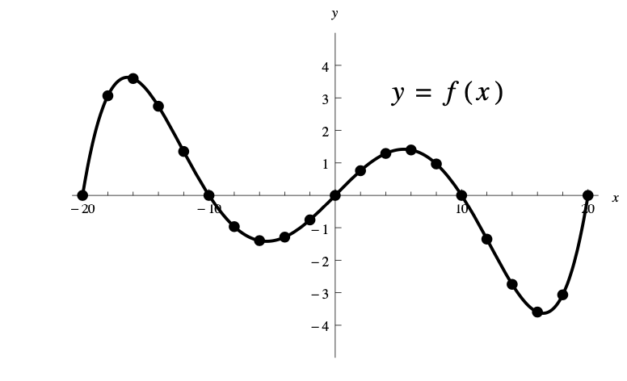

**Math 102 Precalculus- Problem Set 2: Graphs of Functions, Average Rate
of Change, Algebra with Functions\
**

------------------------------------------------------------------------

1.  Let $f(x) = \frac{1}{3} x + 2$.

    -   Fill in the following table.

            $x$     $-6$   $-3$   $0$   $3$   $6$
          -------- ------ ------ ----- ----- -----
           $f(x)$                               

    -   Use your table to graph this function.

    -   Determine the domain of $f(x)$.

    -   Determine the range of $f(x)$.

2.  Let $f(x) = \sqrt{ 2 x}$.

    -   Fill in the following table.

            $x$     $0$   $2$   $\frac{9}{2}$   $8$   $18$
          -------- ----- ----- --------------- ----- ------
           $f(x)$                                        

    -   Use your table to graph this function.

    -   Determine the domain of $f(x)$.

    -   Determine the range of $f(x)$.

3.  Let $g(x) = x^2-2$.

    -   Graph this function.

    -   What is its domain?

    -   What is its range? Write your answer in interval notation.

4.  Let
    $$f(x) = \begin{cases}  x+4 \quad & x \leq 2 \\ 4 & x > 2. \end{cases}$$

    -   Graph this function. Hint: Start by making a table of some
        values of this function.

    -   What is its domain?

    -   What is its range? Write your answer in interval notation.

5.  Let
    $$f(x) = \begin{cases}  x^2 \qquad & -1 \leq x \leq 2 \\ -2 & 2< x\leq 3 \\ x+1 & x > 3. \end{cases}$$

    -   Graph this function. Hint: Start by making a table of some
        values of this function.

    -   What is its domain? Write your answer in interval notation.

    -   What is its range? Write your answer in interval notation.

6.  Use the graph of $y = f(x)$ below to answer the following questions.

    

    -   Evaluate $f(-18)$.

    -   Is $f(6) < 0$? Explain briefly.

    -   Determine all of the zeros.

    -   Determine the $y$-intercept.

    -   How many solutions does the equation $f(x) = 1$ have?

7.  Let $f(x) = 2 | x | +1$.

    -   Graph this function.

    -   Explain why your graph shows that $f(x)$ is an even function.

    -   Show, algebraically, that $f(x)$ is an even function.

8.  Let $g(x) = x^3-x$.

    -   Graph this function.

    -   Explain why your graph shows that $g(x)$ is an odd function.

    -   Show, algebraically, that $g(x)$ is an odd function.

9.  Let $h(x) = |x-3| - 2$.

    -   Use the graph of $h(x)$ to determine if $h(x)$ is an even
        function, an odd function, or neither.

    -   Use algebra to determine if $h(x)$ is an even function, an odd
        function, or neither.

    -   Which method, (a) or (b), do you prefer? Explain briefly.

10. Suppose that $f(x)$ is an odd function and $0$ is in the domain of
    $f(x)$. What is $f(0)$ equal to? Explain your reasoning either using
    a graph or by using algebra.

11. Use the graph of $y = f(x)$ below to answer the following questions.

    

    -   Is $f(x)$ an even function? Explain briefly.

    -   Determine the interval(s) on which $f(x)$ is increasing.

    -   Determine the interval(s) on which $f(x)$ is decreasing.

    -   Are there any intervals where $f(x)$ is constant?

12. Let $g(x) = -2x^2+ x + 5$. Determine the average rate of change of
    $g(x)$ on the interval $[-2, 3]$.

13. Use the following table to determine the average rate of change of
    $h(x)$ on the interval $[2, 6]$.

        $x$     $0$   $1$   $2$   $5$   $6$
      -------- ----- ----- ----- ----- ------
       $h(x)$   -3    -1    2.4    7    10.5

14. Suppose that the function $f(x)$ is constant on the interval
    $[a, b]$. What is the average rate of change of $f(x)$ on this
    interval? Explain your reasoning.

15. Let $f(x) = 3x^2- 2$. Let $g(x) = \frac{1}{x+1}$.

    -   Determine $f(x) + g(x)$. What is the domain?

    -   Determine $f(x) - g(x)$. What is the domain?

    -   Determine $f(x)g(x)$. What is the domain?

    -   Determine $\frac{f(x)}{g(x)}$. What is the domain? (Be careful.)

16. Let $f(x) = x^2+x$, let $g(x) = \sqrt{x}$.

    -   Determine $(f \circ g)(x)$.

    -   Evaluate $(f \circ g)(1)$ and $(f \circ g)(\frac{9}{4})$.

    -   Determine $(g \circ f)(x)$.

    -   Evaluate $(g \circ f)(2)$ and $(g \circ f)(-3)$.

17. Use the tables below to answer the following questions. Some of the
    answers might be undefined, if so write "undefined\".

        $x$     $5$   $6$   $7$   $8$   $9$
      -------- ----- ----- ----- ----- -----
       $f(x)$    8     7     6     5     4

        $x$     $5$   $6$   $7$   $8$   $9$
      -------- ----- ----- ----- ----- -----
       $g(x)$    7     8     6     5     4

    -   Evaluate $(f \circ g)(6)$.

    -   Evaluate $(g \circ f)(8)$.

    -   Evaluate $(f \circ f)(5)$.

    -   Evaluate $(g \circ g)(6)$.

    -   Evaluate $(f \circ g)(9)$.

    -   Determine all solutions to the equation $f(x+2) = 4$

18. Let $h(x) = \sqrt[3]{4x^2-1}$. Find two functions $f(x)$ and $g(x)$
    such that $h(x) = (f \circ g)(x)$.

19. The volume of a spherical balloon of radius $r$ cm is given by
    $$V(r) = (4/3) \pi r^3 \text{ cm}^3.$$ Suppose that the balloon is
    inflated so that its radius increases from $r = 1$ cm at time
    $t = 0$ seconds at a constant rate of $2$ cm per second.

    -   Find a function $r(t)$ that gives the radius of the balloon
        (in cm) as a function of time (in seconds). Hint: This should be
        a linear function.

    -   Determine a function $V(t)$ that gives the volume of the balloon
        in (cm$^3$) as a function of time (in seconds).

    -   Determine the volume of the balloon after $2$ seconds.

20. Klamath Connections students at HSU recently finished an experiment
    to determine the effects of nitrogen and phosphorus on algae growth.
    They added nitrogen and phosphorus (common ingredients in
    fertilizer) to Klamath river water and recorded an opacity score
    (how cloudy) for the water every 3 days. We expect the negative
    control to have a low opacity score which means it is more
    transparent than water with added nitrogen and phosphorus.
    Summarizing: negative control is Klamath water without nitrogen and
    phosphorus added, treatment is Klamath water with nitrogen and
    phosphorus added, positive control is a commercial growth medium
    with nutrients and pH optimized for algal growth.

    The results look something like this:

    

    Using this graph answer the following questions. Note that you can
    **ignore** the graph for the **positive control**.

    -   What is the average rate of change for treated samples over the
        21 days?

    -   What is the average rate of change for untreated samples
        (negative control) over the 21 days?

    -   Determine a piece-wise function that models the treated samples.
        Use correct function notation. For example, for a start:
        $$O(t) = \begin{cases} \ \ \ \  & t<6, \\ \ \ \ \   &6 \leq t < 9, \\ \ \ \ \   & \ \ \ \ \ \ \ \ \ \ \ \  , \\ \ \ \  &  \ \ \ \ \ \ \ \ \ \ \ \ . \end{cases}$$

    -   Why is a piece-wise function a good way to model the treated
        samples?

    -   Determine a function, $N(t)$, that models the untreated samples
        (negative control).

    -   Determine $O(21)$.

    -   Determine $N(21)$.

    -   What do your answers to parts (f) and (g) tell you about the
        affect of adding nitrogen and phosphorus to river water?

21. The following puzzle appeared in Season 9, Episode 17 of the
    Simpsons.

    

    1.  Can you find the next term in the sequence? Hint: each term has
        symmetry. If you cover the left half of each term, this might
        help you see the solution.

    2.  Which of the terms could be a graph of a function? Hint: apply
        the vertical line test.

22. REFLECTION AND CONSOLIDATION (Hint: this will form part of a study
    guide for your first exam!)

    1.  Summarize the main ideas/formulas you used for this problem set.
        You can list formulas, bullet-out phrases, write a paragraph,
        draw sketches, or answer this question in any way that makes
        sense to you.

    2.  What three problems were the most challenging for you? After
        deciding, look at your solutions carefully, and write a short
        explanation of what you found challenging and how you overcame
        this challenge in your problem solving. For example, did you
        find a simpler problem about the same topic? Did you guess and
        check? Did you graph with technology?

    3.  Write three potential test questions on the topics covered in
        this problem set.
